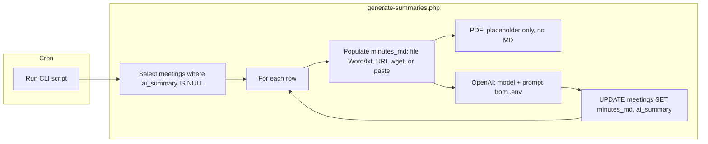

# Periodic Backend Process for AI Summaries

## Current state

- **Meetings table** ([public/submit.php](public/submit.php)): Stores `document_type` (`file` | `url` | `paste`), `file_path`, `document_url`, `pasted_text`, and `description` (user-entered short description). No dedicated column for an AI-generated summary today.
- **OpenAI usage**: [public/generate-summary.php](public/generate-summary.php) runs only in the browser on file upload: uploads file to OpenAI, uses Assistants API (vector store + assistant + thread + run) to get 3–5 bullets, returned to the client. It does **not** handle paste or URL, and does **not** write to the DB.
- **Config**: [config/config.php](config/config.php) already reads `OPENAI_API_KEY`, `USE_AI_FOR_MINUTES_SUMMARY`, `OPENAI_MODEL`, and `OPENAI_SUMMARY_PROMPT` from .env; upload dir and allowed extensions are defined.

## Goal

A **separate process** (CLI script) that:

1. Runs periodically (e.g. cron).
2. Finds meetings that do not yet have an AI summary.
3. For each meeting, populates **minutes_md** (markdown content) and then calls OpenAI:
  - **File (Word / .txt)**: If `file_path` is NOT null and file is MS Word (`.doc`/`.docx`) or `.txt`, extract text (e.g. [src/TextExtractor.php](src/TextExtractor.php)), convert to markdown, save to `minutes_md`, then ask OpenAI for summary.
  - **File (PDF)**: Placeholder only — do **not** convert to MD; skip or stub (e.g. log “PDF not yet supported”).
  - **URL** (`document_url`): Fetch document (e.g. wget or cURL; likely Google Doc), convert to markdown, save to `minutes_md`, then ask OpenAI.
  - **Paste** (`pasted_text`): Copy `pasted_text` into `minutes_md`, then ask OpenAI.
4. Uses **OpenAI model and prompt from .env** (no hardcoding): `OPENAI_MODEL` and `OPENAI_SUMMARY_PROMPT` (via [config/config.php](config/config.php)).
5. Stores the AI summary in the **meetings** table (`ai_summary`).

---

## 1. Database: store markdown and summary

- **minutes_md**: Add a column to store the markdown version of the meeting minutes (filled from file extraction, URL fetch, or pasted text). Used as input to OpenAI.  
  - Migration: `ALTER TABLE meetings ADD COLUMN minutes_md MEDIUMTEXT NULL COMMENT 'Markdown content used for AI summary';`
- **ai_summary**: Add a nullable column for the AI-generated summary (does not overwrite user `description`).  
  - Migration: `ALTER TABLE meetings ADD COLUMN ai_summary TEXT NULL COMMENT 'AI-generated summary';`
- Provide migration snippets in [docs/schema.sql](docs/schema.sql) for both columns.

---

## 2. CLI script: single entry point

- **Location**: e.g. `scripts/generate-summaries.php` or `cli/generate-summaries.php` (project root relative). Run from CLI only: `php scripts/generate-summaries.php`.
- **Bootstrap**: Require `config/config.php`, `config/db.php`, `config/logger.php`; resolve paths from project root (e.g. `dirname(__DIR__)`).
- **Guard**: If `OPENAI_API_KEY` is empty or `USE_AI_FOR_MINUTES_SUMMARY` is false, exit with a short message (no error).
- **Select work**:  
`SELECT id, document_type, file_path, document_url, pasted_text FROM meetings WHERE ai_summary IS NULL AND document_type IN ('file','url','paste') ORDER BY id ASC LIMIT N`  
Use a small `N` per run (e.g. 5–10) to avoid long runs and rate limits.
- **Per row**:
  - Populate **minutes_md** from the source (see section 3). Optionally `UPDATE meetings SET minutes_md = :md WHERE id = :id` after obtaining MD (or in same final update).
  - If **minutes_md** is empty or too short after trimming, skip and optionally leave NULL and log.
  - Call OpenAI using **model and prompt from config** (see section 4).
  - On success: `UPDATE meetings SET ai_summary = :summary, minutes_md = :minutes_md, updated_at = NOW() WHERE id = :id` (or two updates if preferred).
  - On failure: log (meeting id, error), do not update; continue to next row.
- **Idempotency**: Only process rows where `ai_summary IS NULL` so the job can be run repeatedly without re-processing.

---

## 3. Populating minutes_md per source type

| Source                 | How to get content → minutes_md                                                                                                                                                                                                                                                                 |
| ---------------------- | ----------------------------------------------------------------------------------------------------------------------------------------------------------------------------------------------------------------------------------------------------------------------------------------------- |
| **file** (Word / .txt) | If `file_path` is NOT null and extension is MS Word (`.doc`, `.docx`) or `.txt`: use [src/TextExtractor.php](src/TextExtractor.php) (or equivalent) to extract text, convert to markdown (e.g. preserve paragraphs, optional headings), save to `minutes_md`. Then use `minutes_md` for OpenAI. |
| **file** (PDF)         | **Placeholder only**: do not convert to MD. Implement a stub (e.g. `handle_pdf_file_path(...)`) that logs “PDF not yet supported” and skips OpenAI for that row (or leave `minutes_md` NULL and skip).                                                                                          |
| **url**                | When `document_url` is provided (e.g. Google Doc): fetch with wget/cURL/`file_get_contents` (timeout ~15–30s, size limit e.g. 500 KB). Convert response to markdown (e.g. strip HTML and normalize to MD), save to `minutes_md`, then call OpenAI.                                              |
| **paste**              | When `pasted_text` is provided: copy `pasted_text` into `minutes_md` (strip HTML if needed, trim). Then call OpenAI with `minutes_md`.                                                                                                                                                          |

- **Note on cloud docs**: Google Docs share links often return HTML or export formats; the script should handle publicly accessible content and convert to markdown before storing in `minutes_md`.

---

## 4. OpenAI: model and prompt from .env (no hardcoding)

- **Model**: Use the value from config, which reads **OPENAI_MODEL** from .env (e.g. `gpt-3.5-turbo`, `gpt-4o-mini`). Do not hardcode the model name in the CLI script.
- **Prompt**: Use the value from config, which reads **OPENAI_SUMMARY_PROMPT** from .env (e.g. “Summarize the following meeting minutes in more than 10 bullet points in English…”). Do not hardcode the prompt in the CLI script.
- **API**: Use **Chat Completions API** with the configured model; send `minutes_md` as the user message and the configured summary prompt (or combine prompt + content per your design). Parse the assistant reply and store in `ai_summary`.
- Reuse the same timeout and error handling patterns as in `generate-summary.php` where applicable (e.g. 90s for HTTP, retries optional later).

---

## 5. Shared OpenAI helper (optional but recommended)

- Move the existing `openaiRequest` (and any shared constants) from [public/generate-summary.php](public/generate-summary.php) into a small shared helper, e.g. `src/OpenAIHelper.php` or `config/openai.php`, so both the web script and the CLI script can use it. This avoids duplication and keeps behavior (headers, timeouts, Assistants v2 header) consistent.
- The CLI script and `generate-summary.php` would then require this helper and call the same function.

---

## 6. Scheduling (cron)

- Document running the script on a schedule, e.g.:  
`*/10 * * * * cd /path/to/MeetingMinutesSystem && php scripts/generate-summaries.php >> logs/cron-summaries.log 2>&1`  
(every 10 minutes; adjust path and log location as needed.)
- The script should be safe to run multiple times (only processes rows with `ai_summary IS NULL`).

---

## 7. Admin UI (optional)

- If the admin list view ([public/admin/index.php](public/admin/index.php)) should show the AI summary, add a column or section that displays `ai_summary` when present (e.g. “AI summary” below or instead of description when populated). This is a small follow-up once the column and script exist.

---

## 8. Files to add or change

| Action          | File                                                                                                                                                              |
| --------------- | ----------------------------------------------------------------------------------------------------------------------------------------------------------------- |
| Add             | Migration: `docs/schema.sql` – `minutes_md MEDIUMTEXT NULL` and `ai_summary TEXT NULL`                                                                            |
| Add             | `scripts/generate-summaries.php` – CLI loop: populate `minutes_md` (file Word/txt, URL, paste), PDF placeholder, OpenAI call (model + prompt from config), UPDATE |
| Add (optional)  | Shared helper e.g. `src/OpenAIHelper.php` – Chat Completions using config `openai.model` and `openai.summary_prompt`                                              |
| Edit            | `config/config.php` – ensure `openai.model` and `openai.summary_prompt` are read from .env (already present)                                                      |
| Edit            | `docs/PRODUCTION-DEPLOY.md` or README – document cron, `minutes_md`, and `ai_summary`; document `OPENAI_MODEL` and `OPENAI_SUMMARY_PROMPT`                        |
| Edit (optional) | `public/admin/index.php` – show `ai_summary` when present                                                                                                         |

---

## Flow (high level)

---

## Summary

- Add **minutes_md** (markdown content) and **ai_summary** to `meetings`. **CLI script** selects rows without a summary and, per source: **(1)** File Word/.txt → extract text, convert to MD, save to `minutes_md`, then OpenAI; **(2)** File PDF → placeholder only (no MD); **(3)** `document_url` → wget/fetch, convert to MD, save to `minutes_md`, then OpenAI; **(4)** `pasted_text` → copy to `minutes_md`, then OpenAI. Use **OPENAI_MODEL** and **OPENAI_SUMMARY_PROMPT** from .env (via config) for the OpenAI call; do not hardcode model or prompt. Optionally add shared OpenAI helper and document cron; optionally show `ai_summary` in the admin UI.

